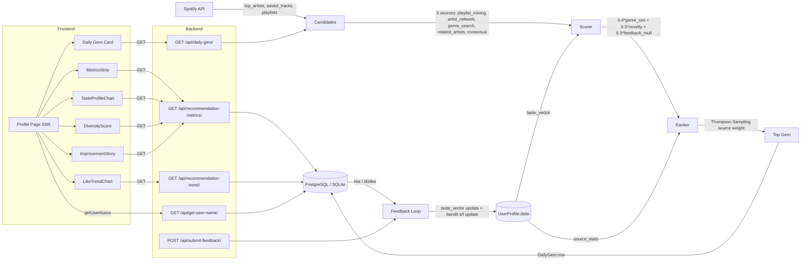

# 04-04 Summary — CONCEPTS.md + SYSTEM_DESIGN.md

## What Was Built

Two interview-ready Markdown files at repo root. Both complement `INTERVIEW_PREP_SONGSCOPE.md` and do not replace it (D-12 satisfied).

## Line Counts

| File | Lines | Minimum Required |
|------|-------|-----------------|
| `CONCEPTS.md` | 394 | 250 |
| `SYSTEM_DESIGN.md` | 254 | 80 |

## CONCEPTS.md — H2 Section List (locked 8)

1. `## Cosine Similarity`
2. `## Novelty Scoring (Bell-Curve)`
3. `## Thompson Sampling`
4. `## Online Learning (SGD on Taste Vector)`
5. `## Jaccard Diversity`
6. `## Recommendation Evaluation Metrics`
7. `## Compound Success Metric`
8. `## Spotify API Deprecation Pivot`

Each non-pivot section follows the locked four-block structure: Intuition → Formula → Code → Interview Talking Point. 30 H3 subheadings total (>= 24 required). 6 `# Source:` citations pointing to real codebase files and line ranges.

## SYSTEM_DESIGN.md — Mermaid Diagram (canonical architecture artifact)

All skeleton edges from 04-RESEARCH.md are preserved. Frontend layer (Profile Page + 6 child components + 4 backend views) added on top.

## Deviations

None. All acceptance criteria met on first pass.

## Acceptance Criteria Results

| Check | Result |
|-------|--------|
| CONCEPTS.md >= 250 lines | 394 lines PASS |
| SYSTEM_DESIGN.md >= 80 lines | 254 lines PASS |
| 8 H2 headings in CONCEPTS.md | 8 PASS |
| >= 24 locked H3 subheadings | 30 PASS |
| >= 5 Source citations in CONCEPTS.md | 6 PASS |
| SYSTEM_DESIGN.md mermaid fence | 1 PASS |
| flowchart directive present | 1 PASS |
| >= 9 component H3 headings in SYSTEM_DESIGN.md | 10 PASS |
| All 5 candidate strategy names in SYSTEM_DESIGN.md | 7 mentions PASS |
| Scoring weights in SYSTEM_DESIGN.md | 4 mentions PASS |
| Phase 4 endpoints in SYSTEM_DESIGN.md | 7 mentions PASS |
| CONCEPTS.md cross-refs SYSTEM_DESIGN.md | 2 PASS |
| CONCEPTS.md cross-refs INTERVIEW_PREP | 2 PASS |
| SYSTEM_DESIGN.md cross-refs CONCEPTS.md | 2 PASS |
| SYSTEM_DESIGN.md cross-refs INTERVIEW_PREP | 1 PASS |
| audio-features mentions (deprecation pivot) | 3 PASS |
| "deprecat" mentions | 4 PASS |
| compound weights (0.4/0.3) present | 4 PASS |
| No emojis in either file | 0 PASS |
| INTERVIEW_PREP_SONGSCOPE.md unchanged | 0 diff lines PASS |

## Human Checkpoint (Task 3)

Status: APPROVED (2026-05-12) — Mermaid diagram renders on GitHub, code snippets verified accurate, deprecation pivot story present, all 3 docs coexist at repo root. CONCEPTS.md and SYSTEM_DESIGN.md merged to main.
