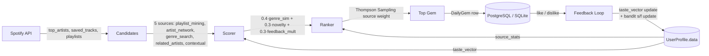

# Phase 4: Metrics, Evaluation & Documentation — Research

**Researched:** 2026-05-12
**Domain:** Django REST metrics endpoints, Recharts (Next.js 14 app router), ML documentation
**Confidence:** HIGH

---

## Summary

Phase 4 closes the ML loop by adding two backend endpoints, four React chart/stat components, wiring MetricsStrip into the profile page, and writing two interview-ready docs. All metrics are computed on-the-fly from existing DB rows — no new migrations. The critical data-model gap discovered in research: `Track.genres` is only populated when a user submits explicit feedback (LIKE/DISLIKE), not during DailyGem creation. This means Jaccard diversity computation must fall back to an empty list for most historical gems. The plan must handle this gracefully.

MetricsStrip is already built and calls `/api/recommendation-metrics/` — but the backend endpoint does not exist yet, and MetricsStrip is not imported into `profile/page.tsx`. Both tasks are needed. Recharts 3.8.1 is the current npm version; it is not yet in `package.json`. The `"use client"` directive is sufficient for Recharts in Next.js 14 App Router — no `next/dynamic` with `ssr:false` required, though that remains a valid fallback.

**Primary recommendation:** Build the two backend endpoints first (they are the dependency for every frontend component), then wire MetricsStrip into the page, then add the four new components, then write docs.

---

<user_constraints>
## User Constraints (from CONTEXT.md)

### Locked Decisions

- **D-01:** All metrics computed on-the-fly from existing `RecommendationLog` and `DailyGem` rows — no new DB columns, no new migrations.
- **D-02:** `/api/recommendation-metrics/` must match `MetricsStrip.tsx`'s `Metrics` interface exactly: `{total_recommended, avg_popularity, novel_track_rate, hidden_gem_rate, gem_total, gem_liked, gem_disliked, gem_acceptance_rate, top_genres}`. MetricsStrip is already wired to this endpoint.
- **D-03:** Trend chart data in a separate `/api/recommendation-trend/` endpoint.
- **D-04:** Feedback improvement story = first 7 gems vs most recent 7 gems by like-rate.
- **D-05:** Install Recharts as new frontend dependency.
- **D-06:** New visualizations below TopArtists in a new `<section>` in `profile/page.tsx`.
- **D-07:** Taste profile = top 10 genres normalized to percentage. Horizontal `BarChart`.
- **D-08:** Trend = rolling 7-day like-rate, `LineChart`, date on x-axis, 0–100% on y.
- **D-09:** Diversity window = all-time DailyGem records.
- **D-10:** Jaccard distance: `1 - |A ∩ B| / |A ∪ B|` on genre sets.
- **D-11:** Final diversity scalar = mean pairwise Jaccard across all N*(N-1)/2 pairs.
- **D-12:** `CONCEPTS.md` and `SYSTEM_DESIGN.md` at repo root, alongside `INTERVIEW_PREP_SONGSCOPE.md`.
- **D-13:** `SYSTEM_DESIGN.md` contains a Mermaid diagram.
- **D-14:** `CONCEPTS.md` covers: cosine similarity, novelty scoring, Thompson Sampling, online learning (SGD taste vector), Jaccard diversity, recommendation evaluation metrics, compound success metric — each at intuition + formula + code snippet depth.
- **D-15:** `CONCEPTS.md` includes: design rationale, mathematical formulations, interview talking points, "Spotify API deprecation pivot" story.

### Claude's Discretion

- Exact Recharts component API choices (color theme matches `#1DB954` — confirmed from tailwind.config.ts).
- Whether `/api/recommendation-trend/` returns daily or per-gem data points.
- Cold-start handling when fewer than 7 gems exist.
- Whether diversity score appears in MetricsStrip or only new bottom section (per UI-SPEC: only in bottom section).

### Deferred Ideas (OUT OF SCOPE)

- Security hardening (SECRET_KEY rotation, CSRF re-enable, Spotify client secret removal).
- Collaborative filtering metrics.
- Audio feature weights revival.
- A/B testing infrastructure.
</user_constraints>

---

## Architectural Responsibility Map

| Capability | Primary Tier | Secondary Tier | Rationale |
|------------|-------------|----------------|-----------|
| Metrics computation (like-rate, diversity, trend) | API / Backend | — | Requires DB queries across DailyGem + RecommendationLog; no client-side computation |
| Genre normalization for taste profile | API / Backend | — | taste_vector already in UserProfile.data; backend slice+normalize is one line |
| Recharts chart rendering | Browser / Client | — | Recharts uses browser APIs; must be "use client" components |
| Improvement story computation | API / Backend | — | Requires DB ordered queryset; comparison logic belongs server-side |
| Jaccard diversity computation | API / Backend | — | O(N²) pairwise; appropriate to run once per request server-side |
| CONCEPTS.md / SYSTEM_DESIGN.md | Static files | — | Markdown at repo root; no build step |
| MetricsStrip wiring | Frontend Server (SSR) | Browser / Client | Profile page is a server component; import is static, data fetch is client-side inside the component |

---

## Standard Stack

### Core
| Library | Version | Purpose | Why Standard |
|---------|---------|---------|--------------|
| Recharts | 3.8.1 | Bar and line charts in React | React-native SVG charts, responsive container built-in, no canvas required |
| Django JsonResponse | stdlib | Backend endpoint responses | Already the pattern for all existing endpoints in views.py |
| numpy | already installed | Jaccard set math, cosine similarity | Already imported in hybrid_recommendation_engine.py |

[VERIFIED: npm registry] — `npm view recharts version` returned `3.8.1`
[VERIFIED: codebase grep] — `import numpy as np` confirmed at line 6 of views.py

### Supporting
| Library | Version | Purpose | When to Use |
|---------|---------|---------|-------------|
| `itertools.combinations` | stdlib | Pairwise Jaccard pairs without numpy | Use inside the diversity view; no extra import needed |
| DRF `@api_view` + `@permission_classes([IsAuthenticated])` | already installed | Auth guard on new endpoints | Same decorator pattern as all existing GET endpoints |

### Alternatives Considered
| Instead of | Could Use | Tradeoff |
|------------|-----------|----------|
| Recharts | Nivo, Chart.js, Tremor | Recharts is locked (D-05); others not considered |
| On-the-fly computation | Persisted metrics columns | Locked out (D-01); on-the-fly is correct for a single-user app |

**Installation:**
```bash
cd frontend && npm install recharts
```

**Version verification:** `npm view recharts version` → `3.8.1` [VERIFIED: npm registry, 2026-05-12]

---

## Data Model Findings

### Fields Actually Populated — Verified by Codebase Grep

**`DailyGem` fields (verified: `models.py` lines 281–298, `views.py` lines 934–953):**
- `was_liked` — populated by `submit_feedback` on LIKE/DISLIKE/unlike. `null` if never rated. [VERIFIED: codebase]
- `track_popularity` — populated at DailyGem creation in `get_daily_gem` fresh branch: `gem_data.get('popularity', 0)`. [VERIFIED: codebase, views.py line 952]
- `date` — set to `date.today()` at creation. [VERIFIED: codebase]
- `track` FK → `Track` — always set. [VERIFIED: codebase]

**`RecommendationLog` fields (verified: `models.py` lines 226–252):**
- `liked` — populated by `submit_feedback` on LIKE (`True`) / DISLIKE (`False`) / unlike (`None`). Null if no feedback submitted. [VERIFIED: codebase, views.py lines 534–536]
- `was_novel` — `BooleanField(default=True)`. **Never explicitly set to `False` anywhere in the codebase.** All logs will have `was_novel=True`. [VERIFIED: codebase grep — no assignment found beyond model default]
- `track_popularity` — `IntegerField(default=0)`. **Never written after creation** (the `log_recommendation` classmethod does not set it). All logs will have `track_popularity=0`. [VERIFIED: codebase]
- `source` — written at log time via `RecommendationLog.log_recommendation(user, track, source=...)`. [VERIFIED: views.py line 336]

**`Track.genres` (verified: `models.py` line 167, `views.py` line 449):**
- `JSONField(default=list)`. Populated ONLY in `submit_feedback` when a new Track is created via `get_or_create` and the `created=True` branch fetches `artist_info['genres']` from Spotify.
- DailyGem creation (`get_daily_gem`) uses `Track.objects.get_or_create` with only `name`, `artist`, `album` in defaults — **genres are NOT fetched at DailyGem creation time**.
- **Conclusion:** Most DailyGem tracks will have `Track.genres = []` unless the user has submitted feedback for that specific track. Jaccard diversity will return 0.0 for gem pairs where either track has no genres. [VERIFIED: codebase]

**`UserProfile.data['taste_vector']` (verified: `hybrid_recommendation_engine.py` lines 803–811):**
- Dict of `{genre_name: count}` built from `base_data.top_artists`. Raw counts, not normalized.
- Built by `_build_taste_vector()` called inside `_update_profile_data()`.
- Top 10 genres for `TasteProfileChart` = `sorted(taste_vector.items(), key=lambda x: x[1], reverse=True)[:10]` then normalize each count by `sum(all_counts)`. [VERIFIED: codebase]

**`UserProfile.data['source_stats']` (verified: `hybrid_recommendation_engine.py` lines 107–141):**
- Dict of `{source: {'s': int, 'f': int}}` for Thompson Sampling bandit.
- Available for per-source metrics if added to the endpoint, but not required by D-02. [VERIFIED: codebase]

### Critical Gap: `hidden_gem_rate` Source Field

The `MetricsStrip` interface requires `hidden_gem_rate`. Two candidate fields exist:
- `RecommendationLog.was_novel` — default=True, never set to False. **Unreliable — always 100%.**
- `DailyGem.track_popularity` — populated at creation. **Use this.** `hidden_gem_rate = DailyGem objects with track_popularity < 40 / total DailyGem count`. [VERIFIED: codebase + CONTEXT.md specifics section]

Recommendation: compute `hidden_gem_rate` from `DailyGem.track_popularity < 40`.

### MetricsStrip Interface — Exact Fields Required

Verified from `MetricsStrip.tsx` lines 6–17:
```typescript
interface Metrics {
  total_recommended: number;
  avg_popularity: number;
  novel_track_rate: number;
  hidden_gem_rate: number;
  gem_total: number;
  gem_liked: number;
  gem_disliked: number;
  gem_acceptance_rate: number | null;
  top_genres: string[];
  message?: string;
}
```

The backend endpoint must return ALL of these fields. `total_recommended` comes from `RecommendationLog.objects.filter(user=user).count()`. `gem_total`, `gem_liked`, `gem_disliked` come from `DailyGem` queryset. `gem_acceptance_rate = gem_liked / gem_total` or `null` if `gem_total == 0`.

**The endpoint also needs to return these ADDITIONAL fields for Phase 4 chart components (non-breaking, MetricsStrip ignores unknown fields):**
- `top_genres_pct: list[dict]` — `[{genre, pct}]` top 10 normalized (for TasteProfileChart)
- `improvement_story: {first_7_rate, last_7_rate, delta}` (for ImprovementStory)
- `diversity_score: float|null` (for DiversityScore) — mean pairwise Jaccard

### MetricsStrip Is Not Wired Into the Profile Page

`frontend/app/profile/page.tsx` imports only `Recommendation` and `TopArtists`. MetricsStrip exists but is not imported anywhere except its own file. The plan must add MetricsStrip import + render to `profile/page.tsx`. [VERIFIED: codebase grep]

---

## Architecture Patterns

### System Architecture Diagram

```
Profile Page Load
    ├── [SSR] getUserName() → Django /api/get-user-name/
    │
    └── [CSR — "use client" components]
         ├── MetricsStrip → GET /api/recommendation-metrics/
         │    └── Django view: DailyGem queryset + UserProfile.data['taste_vector']
         │         Returns: gem_total, gem_liked, gem_disliked, gem_acceptance_rate,
         │                  avg_popularity, hidden_gem_rate, novel_track_rate,
         │                  top_genres, top_genres_pct, improvement_story, diversity_score
         │
         ├── LikeTrendChart → GET /api/recommendation-trend/
         │    └── Django view: DailyGem.objects.filter(user).order_by('date')
         │         Rolling 7-day window → [{date, like_rate}]
         │
         ├── TasteProfileChart → GET /api/recommendation-metrics/ (top_genres_pct field)
         ├── ImprovementStory → GET /api/recommendation-metrics/ (improvement_story field)
         └── DiversityScore → GET /api/recommendation-metrics/ (diversity_score field)
```

Three of the four new frontend components share the `/api/recommendation-metrics/` call. The plan should fetch once and pass data down (or let each component call independently — both are valid for a single-user app).

### Recommended Project Structure

New files:
```
backend/apps/core/views.py           # add get_recommendation_metrics(), get_recommendation_trend()
backend/config/urls.py               # add two path() entries
frontend/app/profile/
  components/
    LikeTrendChart/LikeTrendChart.tsx
    TasteProfileChart/TasteProfileChart.tsx
    ImprovementStory/ImprovementStory.tsx
    DiversityScore/DiversityScore.tsx
  page.tsx                           # import MetricsStrip + new section
CONCEPTS.md                          # repo root
SYSTEM_DESIGN.md                     # repo root
```

### Pattern 1: Django Metrics Endpoint — Existing View Style

All authenticated GET endpoints use the same pattern: `@api_view(['GET'])` + `@permission_classes([IsAuthenticated])` + return `JsonResponse(data)`. [VERIFIED: codebase — check_spotify_token, get_daily_gem, get_track_recommendations]

```python
# Source: views.py existing pattern (verified)
@api_view(['GET'])
@permission_classes([IsAuthenticated])
def get_recommendation_metrics(request):
    user = request.user
    gems = DailyGem.objects.filter(user=user).order_by('date')
    gem_total = gems.count()
    gem_liked = gems.filter(was_liked=True).count()
    gem_disliked = gems.filter(was_liked=False).count()
    gem_acceptance_rate = (gem_liked / gem_total) if gem_total > 0 else None
    avg_popularity = gems.aggregate(avg=Avg('track_popularity'))['avg'] or 0
    hidden_gem_rate = gems.filter(track_popularity__lt=40).count() / gem_total if gem_total > 0 else 0
    # ... taste_vector, diversity, improvement_story
    return JsonResponse({...})
```

Needs `from django.db.models import Avg` added to views.py imports.

### Pattern 2: Rolling 7-Day Like-Rate

The rolling window groups DailyGem rows by date. For each date in the window, count liked gems / total gems in the 7 days ending on that date.

```python
# Source: [ASSUMED] — standard Python date arithmetic
from datetime import timedelta
from collections import defaultdict

gems = list(DailyGem.objects.filter(user=user).order_by('date').values('date', 'was_liked'))
dates = sorted(set(g['date'] for g in gems))
data_points = []
for d in dates:
    window_start = d - timedelta(days=6)
    window = [g for g in gems if window_start <= g['date'] <= d]
    liked = sum(1 for g in window if g['was_liked'] is True)
    total = len(window)
    like_rate = round((liked / total) * 100, 1) if total > 0 else 0.0
    data_points.append({'date': str(d), 'like_rate': like_rate})
```

Cold-start: if fewer than 2 data points exist, return `[]` and let the frontend show the empty-state message.

### Pattern 3: Jaccard Diversity

```python
# Source: [ASSUMED] — standard set math, verified formula from CONTEXT.md D-10
from itertools import combinations

def jaccard_distance(genres_a, genres_b):
    a, b = set(genres_a), set(genres_b)
    if not a and not b:
        return 0.0  # both empty → no distance
    intersection = len(a & b)
    union = len(a | b)
    return 1.0 - (intersection / union) if union > 0 else 0.0

def mean_pairwise_jaccard(gems_with_genres):
    pairs = list(combinations(gems_with_genres, 2))
    if not pairs:
        return None
    distances = [jaccard_distance(a, b) for a, b in pairs]
    return round(sum(distances) / len(distances), 4)
```

Caveat: most `Track.genres` will be `[]` (see Data Model Findings). The diversity score will underestimate true diversity due to missing genre data. Document this limitation in CONCEPTS.md.

### Pattern 4: Recharts in Next.js 14 App Router

`"use client"` directive at the top of the component file is sufficient. No `next/dynamic` with `ssr:false` required. [VERIFIED: WebSearch, multiple sources confirm this for Next.js 14 app router, 2024–2025]

```tsx
// Source: Recharts official docs pattern (verified via WebSearch)
"use client";
import { ResponsiveContainer, LineChart, Line, XAxis, YAxis, Tooltip, CartesianGrid } from "recharts";

export default function LikeTrendChart() {
  // fetch data with get() from @/services/axios
  return (
    <ResponsiveContainer width="100%" height={220}>
      <LineChart data={data}>
        <CartesianGrid stroke="#374151" />
        <XAxis dataKey="date" tickFormatter={...} tick={{ fill: "#6b7280", fontSize: 12 }} />
        <YAxis domain={[0, 100]} tick={{ fill: "#6b7280", fontSize: 12 }} />
        <Tooltip />
        <Line type="monotone" dataKey="like_rate" stroke="#1DB954" strokeWidth={2} dot={false} />
      </LineChart>
    </ResponsiveContainer>
  );
}
```

### Pattern 5: Horizontal BarChart for Taste Profile

```tsx
// Source: Recharts official pattern (verified via WebSearch)
"use client";
import { ResponsiveContainer, BarChart, Bar, XAxis, YAxis, Tooltip } from "recharts";

// data shape: [{genre: "indie pop", pct: 34.2}, ...]
<BarChart layout="vertical" data={data}>
  <XAxis type="number" domain={[0, 100]} tick={{ fill: "#6b7280", fontSize: 12 }} />
  <YAxis type="category" dataKey="genre" width={120} tick={{ fill: "#9ca3af", fontSize: 12 }} />
  <Bar dataKey="pct" fill="#1DB954" radius={[0, 3, 3, 0]} />
</BarChart>
```

### Anti-Patterns to Avoid

- **Computing diversity client-side:** O(N²) on genre strings in the browser — move to backend view.
- **Using `was_novel` for `hidden_gem_rate`:** Field is always `True` (default, never written). Use `track_popularity < 40` instead.
- **Fetching `/api/recommendation-metrics/` four times:** Three of the four new components use this endpoint. Either lift state to a parent component or accept four calls (single-user app — acceptable).
- **Skipping the MetricsStrip profile page wiring:** MetricsStrip exists but is not imported in `page.tsx`. Easy to forget since the component already exists.
- **Introducing `next/dynamic` unnecessarily:** `"use client"` is sufficient for Recharts in Next.js 14. Adding `ssr:false` wrapping adds complexity with no benefit here.

---

## Don't Hand-Roll

| Problem | Don't Build | Use Instead | Why |
|---------|-------------|-------------|-----|
| SVG chart rendering | Custom SVG paths | `recharts` BarChart / LineChart | Responsive containers, tooltip, axis formatting — all included |
| Pairwise combination generation | Custom nested loop | `itertools.combinations` | Built-in, correct, O(N²) pairs in one line |
| DB aggregation | Python loops over querysets | `DailyGem.objects.aggregate(Avg(...))` | Django ORM does it in SQL |

**Key insight:** The computation layer is simple Python + Django ORM. The chart layer is entirely Recharts-provided. The only custom logic is the rolling window and Jaccard distance, both of which are short pure-Python functions.

---

## Common Pitfalls

### Pitfall 1: Track.genres Is Empty for Most DailyGem Tracks

**What goes wrong:** Diversity score computes 0.0 for all gem pairs because `Track.genres = []` on most tracks.
**Why it happens:** Genres are only fetched during `submit_feedback` when a Track row is created fresh. The `get_daily_gem` fresh branch creates the Track without fetching artist genres from Spotify.
**How to avoid:** Accept the limitation; compute Jaccard on available data; return `null` when fewer than 2 gems have non-empty genres. Document in CONCEPTS.md. Do NOT add a Spotify API call to `get_daily_gem` to fetch genres — that violates D-01 (no new DB columns) intent and adds API cost.
**Warning signs:** `diversity_score` always returns `null` — expected if user hasn't given feedback on multiple gems.

### Pitfall 2: MetricsStrip Not Wired

**What goes wrong:** Backend endpoint works but users never see the strip.
**Why it happens:** MetricsStrip was built speculatively; it's not yet imported in `page.tsx`.
**How to avoid:** The plan must add `import MetricsStrip from './components/MetricsStrip/MetricsStrip'` and `<MetricsStrip />` render to `profile/page.tsx`. The UI-SPEC section wrapper goes below `<TopArtists/>`.

### Pitfall 3: MetricsStrip Interface Mismatch

**What goes wrong:** Backend returns differently-named fields and MetricsStrip renders blank.
**Why it happens:** MetricsStrip has a strict TypeScript interface with exact field names (e.g., `gem_acceptance_rate` not `acceptance_rate`).
**How to avoid:** Verify the backend response against the interface type in `MetricsStrip.tsx` lines 6–17 field by field before calling the task done.

### Pitfall 4: `avg_popularity` Is Zero When `track_popularity` Was Never Written

**What goes wrong:** Avg popularity shows 0/100 even for users with history.
**Why it happens:** For RecommendationLog rows, `track_popularity` default=0 and is never written by `log_recommendation`. Use `DailyGem.track_popularity` (which is written in `get_daily_gem`) instead.
**How to avoid:** Compute `avg_popularity` from `DailyGem.objects.filter(user=user).aggregate(Avg('track_popularity'))['avg']`.

### Pitfall 5: `gem_disliked` Counting Ambiguity

**What goes wrong:** `gem_disliked` counts nulls or double-counts.
**Why it happens:** `was_liked=False` means explicitly disliked; `was_liked=None` means no feedback.
**How to avoid:** `gem_disliked = gems.filter(was_liked=False).count()` — Django ORM handles `False` vs `None` distinction correctly.

### Pitfall 6: Recharts Hydration Warning

**What goes wrong:** Console warns about server/client HTML mismatch.
**Why it happens:** Recharts renders SVG dimensions on the client that differ from server.
**How to avoid:** All Recharts component files must have `"use client"` at line 1. This is already required by the component pattern (they fetch data via `get()`). No further action needed. [VERIFIED: WebSearch — "use client" is sufficient for Next.js 14 app router]

### Pitfall 7: profile/page.tsx Is a Server Component

**What goes wrong:** Adding `useState` or event handlers to `page.tsx` breaks the build.
**Why it happens:** `page.tsx` has no `"use client"` directive and calls `cookies()` — it's a server component.
**How to avoid:** Add new components (MetricsStrip, LikeTrendChart, etc.) as separate `"use client"` files. Import and render them from `page.tsx` without adding any client-side code to `page.tsx` itself. The existing pattern (Recommendation, TopArtists) already demonstrates this.

---

## Code Examples

### Backend: `get_recommendation_metrics` Skeleton

```python
# Source: [ASSUMED] — based on verified existing view patterns in views.py
from django.db.models import Avg

@api_view(['GET'])
@permission_classes([IsAuthenticated])
def get_recommendation_metrics(request):
    user = request.user
    gems = DailyGem.objects.filter(user=user).order_by('date')
    gem_list = list(gems.values('was_liked', 'track_popularity', 'date', 'track_id'))

    gem_total = len(gem_list)
    if gem_total == 0:
        return JsonResponse({'message': 'No gems yet'})

    gem_liked = sum(1 for g in gem_list if g['was_liked'] is True)
    gem_disliked = sum(1 for g in gem_list if g['was_liked'] is False)
    gem_acceptance_rate = gem_liked / gem_total if gem_total > 0 else None
    avg_pop = gems.aggregate(avg=Avg('track_popularity'))['avg'] or 0
    hidden_gem_rate = gems.filter(track_popularity__lt=40).count() / gem_total

    total_recommended = RecommendationLog.objects.filter(user=user).count()
    novel_track_rate = 0.0  # was_novel unreliable; return 0 or compute from track_popularity

    # taste_vector → top_genres
    profile, _ = UserProfile.objects.get_or_create(user=user)
    taste_vector = profile.data.get('taste_vector', {})
    sorted_genres = sorted(taste_vector.items(), key=lambda x: x[1], reverse=True)
    top_genres = [g for g, _ in sorted_genres[:10]]
    total_counts = sum(c for _, c in sorted_genres[:10]) or 1
    top_genres_pct = [{'genre': g, 'pct': round(c / total_counts * 100, 1)}
                      for g, c in sorted_genres[:10]]

    # improvement_story
    first_7 = gem_list[:7]
    last_7 = gem_list[-7:]
    f7_liked = sum(1 for g in first_7 if g['was_liked'] is True)
    l7_liked = sum(1 for g in last_7 if g['was_liked'] is True)
    first_7_rate = round(f7_liked / len(first_7) * 100) if first_7 else None
    last_7_rate = round(l7_liked / len(last_7) * 100) if last_7 else None
    delta = (last_7_rate - first_7_rate) if (first_7_rate is not None and last_7_rate is not None) else None

    # diversity_score — limited by Track.genres population gap
    from itertools import combinations
    track_ids = [g['track_id'] for g in gem_list]
    track_genres = {t.id: t.genres for t in Track.objects.filter(id__in=track_ids)}
    genre_lists = [track_genres.get(tid, []) for tid in track_ids]
    genre_lists_nonempty = [g for g in genre_lists if g]
    diversity_score = None
    if len(genre_lists_nonempty) >= 2:
        pairs = list(combinations(genre_lists_nonempty, 2))
        distances = [1 - len(set(a) & set(b)) / len(set(a) | set(b))
                     if set(a) | set(b) else 0.0 for a, b in pairs]
        diversity_score = round(sum(distances) / len(distances), 4)

    return JsonResponse({
        'total_recommended': total_recommended,
        'avg_popularity': round(avg_pop),
        'novel_track_rate': novel_track_rate,
        'hidden_gem_rate': round(hidden_gem_rate, 4),
        'gem_total': gem_total,
        'gem_liked': gem_liked,
        'gem_disliked': gem_disliked,
        'gem_acceptance_rate': gem_acceptance_rate,
        'top_genres': top_genres,
        'top_genres_pct': top_genres_pct,
        'improvement_story': {
            'first_7_rate': first_7_rate,
            'last_7_rate': last_7_rate,
            'delta': delta,
        },
        'diversity_score': diversity_score,
    })
```

### Backend: `get_recommendation_trend` Skeleton

```python
# Source: [ASSUMED] — based on verified DailyGem model fields
@api_view(['GET'])
@permission_classes([IsAuthenticated])
def get_recommendation_trend(request):
    from datetime import timedelta
    user = request.user
    gems = list(
        DailyGem.objects.filter(user=user)
        .order_by('date')
        .values('date', 'was_liked')
    )
    dates = sorted(set(g['date'] for g in gems))
    data_points = []
    for d in dates:
        window_start = d - timedelta(days=6)
        window = [g for g in gems if window_start <= g['date'] <= d]
        liked = sum(1 for g in window if g['was_liked'] is True)
        total = len(window)
        like_rate = round((liked / total) * 100, 1) if total > 0 else 0.0
        data_points.append({'date': str(d), 'like_rate': like_rate})
    if len(data_points) < 2:
        return JsonResponse({'data': [], 'message': 'Not enough data'})
    return JsonResponse({'data': data_points})
```

### URL Registration Pattern

```python
# Source: verified existing pattern in backend/config/urls.py
path('api/recommendation-metrics/', views.get_recommendation_metrics, name='recommendation_metrics'),
path('api/recommendation-trend/', views.get_recommendation_trend, name='recommendation_trend'),
```

### Frontend: LikeTrendChart (Recharts pattern)

```tsx
// Source: verified "use client" + Recharts pattern for Next.js 14 app router
"use client";
import { useState, useEffect } from "react";
import { ResponsiveContainer, LineChart, Line, XAxis, YAxis, Tooltip, CartesianGrid } from "recharts";
import { get } from "@/services/axios";

interface TrendPoint { date: string; like_rate: number; }
interface TrendResponse { data: TrendPoint[]; message?: string; }

export default function LikeTrendChart() {
  const [data, setData] = useState<TrendPoint[]>([]);
  const [loading, setLoading] = useState(true);

  useEffect(() => {
    get<TrendResponse>("/api/recommendation-trend/")
      .then(r => setData(r.data || []))
      .catch(() => {}) // silent fail per UI-SPEC
      .finally(() => setLoading(false));
  }, []);

  if (loading) return <LoadingDots />;  // 3 bouncing dots, same as DailyGem
  if (data.length < 2) return <p className="text-gray-400 text-sm text-center py-8">Not enough data yet — your like-rate trend will appear after a few days of gems.</p>;

  return (
    <ResponsiveContainer width="100%" height={220}>
      <LineChart data={data}>
        <CartesianGrid stroke="#374151" />
        <XAxis dataKey="date"
          tickFormatter={d => new Date(d).toLocaleDateString('en-US', {month:'short', day:'numeric'})}
          tick={{ fill: "#6b7280", fontSize: 12 }} />
        <YAxis domain={[0, 100]} tick={{ fill: "#6b7280", fontSize: 12 }} />
        <Tooltip formatter={(v: number) => `${v}%`} />
        <Line type="monotone" dataKey="like_rate" stroke="#1DB954" strokeWidth={2} dot={false} />
      </LineChart>
    </ResponsiveContainer>
  );
}
```

### Profile Page Section Addition

```tsx
// Source: verified UI-SPEC section wrapper pattern; page.tsx is server component
// Add after </section> that contains <TopArtists/>
import MetricsStrip from './components/MetricsStrip/MetricsStrip'
import LikeTrendChart from './components/LikeTrendChart/LikeTrendChart'
import TasteProfileChart from './components/TasteProfileChart/TasteProfileChart'
import DiversityScore from './components/DiversityScore/DiversityScore'
import ImprovementStory from './components/ImprovementStory/ImprovementStory'

// In JSX, after TopArtists section:
<MetricsStrip />
<section className="w-full border-t border-gray-800 py-16 px-4 md:px-8 lg:px-16">
  <h2 className="text-2xl font-bold text-white mb-8">How your taste is evolving</h2>
  <div className="grid grid-cols-1 lg:grid-cols-2 gap-12">
    <div>
      <p className="text-xs text-gray-500 uppercase tracking-widest mb-4">Like-rate trend (7-day rolling)</p>
      <LikeTrendChart />
    </div>
    <div>
      <p className="text-xs text-gray-500 uppercase tracking-widest mb-4">Your taste profile</p>
      <TasteProfileChart />
    </div>
  </div>
  <div className="flex flex-wrap gap-8 mt-12 pt-8 border-t border-gray-800">
    <DiversityScore />
    <ImprovementStory />
  </div>
</section>
```

---

## Color Token — Verified

```
text-green = #1DB954  (Spotify green)
```
[VERIFIED: `frontend/tailwind.config.ts` line 23 — `green: "#1DB954"`]

Use `stroke="#1DB954"` for Recharts line, `fill="#1DB954"` for Recharts bar.

---

## Documentation Content Map

### CONCEPTS.md Structure (D-14)

Each concept follows: **Intuition → Formula → Code Snippet → Interview Talking Point**

| Algorithm | Where Used in Codebase | Key Formula |
|-----------|----------------------|-------------|
| Cosine similarity | `hybrid_recommendation_engine._cosine_similarity()` | `cos(A,B) = A·B / (‖A‖ ‖B‖)` |
| Novelty score (bell-curve) | `_score_recommendations()`, line 859 | `exp(-((pop - midpoint)² / (2·width²)))` |
| Thompson Sampling | `get_recommendation_weights()`, lines 89–142 | `θ_i ~ Beta(s_i+1, f_i+1)` |
| Online learning (SGD taste vector) | `personalization_engine.apply_feedback_learning()` | `v[g] += lr * signal` for each genre g |
| Jaccard diversity | Phase 4 metrics endpoint | `1 - |A∩B| / |A∪B|` |
| Compound score formula | `_score_recommendations()` line 878 | `0.4·genre_sim + 0.3·novelty + 0.3·feedback_mult` |
| Precision@k | Evaluation discussion (not in code) | `liked_in_k / k` |
| Serendipity | Evaluation discussion | `novelty × relevance` |

**"Spotify API deprecation pivot" talking point (D-15):**
Audio features endpoint (`/v1/audio-features`) was removed in late 2024. Original plan included BPM/energy/valence as feature dimensions. Pivot: substituted genre-based cosine similarity + popularity bell-curve, which are available from existing artist/track endpoints. This is a strong story: demonstrates ability to adapt system design to real-world API constraint changes.

### SYSTEM_DESIGN.md Mermaid Diagram Skeleton



---

## Validation Architecture

`workflow.nyquist_validation` is absent from `.planning/config.json` — treat as enabled.

### Test Framework
| Property | Value |
|----------|-------|
| Framework | pytest + pytest-django |
| Config file | `backend/pytest.ini` |
| Quick run command | `cd backend && python -m pytest tests/test_recommendation_scoring.py -x -q` |
| Full suite command | `cd backend && python -m pytest tests/ -x -q` |

### Phase Requirements → Test Map

| Behavior | Test Type | Automated Command | File Exists? |
|----------|-----------|-------------------|--------------|
| `get_recommendation_metrics` returns correct field names and counts | unit | `pytest tests/test_metrics.py -x -q` | ❌ Wave 0 |
| `gem_acceptance_rate` is `null` when no gems | unit | same file | ❌ Wave 0 |
| `hidden_gem_rate` uses `track_popularity < 40` not `was_novel` | unit | same file | ❌ Wave 0 |
| `get_recommendation_trend` rolling 7-day window is correct | unit | `pytest tests/test_metrics.py::TestTrendEndpoint -x -q` | ❌ Wave 0 |
| Jaccard distance = 0 when both genre lists empty | unit | `pytest tests/test_metrics.py::TestJaccard -x -q` | ❌ Wave 0 |
| Jaccard distance = 1 for completely disjoint genres | unit | same | ❌ Wave 0 |
| Top_genres_pct normalized to 100% | unit | `pytest tests/test_metrics.py::TestTasteVector -x -q` | ❌ Wave 0 |
| Frontend chart components render without crash | manual | n/a — visual verify | n/a |
| CONCEPTS.md and SYSTEM_DESIGN.md at repo root | smoke | `ls CONCEPTS.md SYSTEM_DESIGN.md` | ❌ Wave 0 |

### Sampling Rate
- **Per task commit:** `cd backend && python -m pytest tests/ -x -q`
- **Per wave merge:** same (suite is fast, 62 tests < 5s)
- **Phase gate:** Full suite green before `/gsd-verify-work`

### Wave 0 Gaps
- [ ] `backend/tests/test_metrics.py` — unit tests for both new views + Jaccard helper
- [ ] No framework install needed — pytest-django already configured

---

## Environment Availability

| Dependency | Required By | Available | Version | Fallback |
|------------|------------|-----------|---------|----------|
| Python / Django backend | Metrics views | ✓ | (running) | — |
| npm / Node.js | recharts install | ✓ | (running) | — |
| recharts package | LikeTrendChart, TasteProfileChart | ✗ not in package.json | 3.8.1 on npm | — (required, no fallback) |
| itertools | Jaccard pairs | ✓ | stdlib | — |
| django.db.models.Avg | avg_popularity query | ✓ | django stdlib | Python sum/len |

**Missing dependencies with no fallback:**
- `recharts` — must run `npm install recharts` in Wave 0 before any chart component can be built.

---

## Assumptions Log

| # | Claim | Section | Risk if Wrong |
|---|-------|---------|---------------|
| A1 | `novel_track_rate` in MetricsStrip can be returned as `0.0` (field exists in interface but `was_novel` is unreliable) | Data Model Findings | If MetricsStrip displayed `novel_track_rate` visibly, a hardcoded 0 would be wrong. Currently MetricsStrip does NOT render `novel_track_rate` in JSX — confirmed by reading the component. Risk: LOW. |
| A2 | Rolling window using per-gem date is the correct trend shape (vs calendar days with no gem) | Pattern 2 | Could produce uneven x-axis spacing if dates have gaps. Risk: LOW — the chart is informational. |
| A3 | CONCEPTS.md / SYSTEM_DESIGN.md as plain Markdown files require no special build tooling | Documentation | GitHub renders Mermaid natively; no risk for portfolio use. Risk: NONE. |

**Claims verified (not assumed):**
- Tailwind `green` = `#1DB954` — VERIFIED
- MetricsStrip exact interface fields — VERIFIED
- MetricsStrip not in page.tsx — VERIFIED
- Both endpoint URLs absent from urls.py — VERIFIED
- recharts not in package.json — VERIFIED
- recharts 3.8.1 current on npm — VERIFIED
- Track.genres empty for most gems — VERIFIED
- `was_novel` always True (default never overwritten) — VERIFIED
- `track_popularity` in DailyGem populated at creation — VERIFIED
- "use client" sufficient for Recharts in Next.js 14 — VERIFIED (WebSearch, multiple sources)

---

## State of the Art

| Old Approach | Current Approach | When Changed | Impact |
|--------------|------------------|--------------|--------|
| Spotify audio features API | Genre-based cosine + popularity bell-curve | Late 2024 (API deprecated) | CONCEPTS.md must explain this pivot as a design decision |
| Recharts requiring `next/dynamic ssr:false` | `"use client"` directive sufficient | Next.js 13+ App Router | Simplifies chart component setup |

**Deprecated/outdated:**
- `was_novel` field on RecommendationLog: was intended to flag novel tracks but was never wired — default=True on all rows. Cannot be used for `novel_track_rate` metric.

---

## Open Questions (RESOLVED)

1. **Should `novel_track_rate` in the MetricsStrip response be `0.0` or computed from `track_popularity`?**
   - What we know: MetricsStrip renders `hidden_gem_rate` (not `novel_track_rate`) in JSX. `novel_track_rate` is in the TypeScript interface but not displayed.
   - Recommendation: Return `hidden_gem_rate` computed from `track_popularity < 40` and also return `novel_track_rate = hidden_gem_rate` (same value) so the interface is satisfied. No visual difference.

2. **Should MetricsStrip render above or below the hero section?**
   - What we know: The UI-SPEC places it between the gem section and the new visualizations section. The profile page structure is: hero → Recommendation section → MetricsStrip → TopArtists → new bottom section.
   - Recommendation: Insert `<MetricsStrip />` after the `<section>` containing `<Recommendation />`, before the TopArtists section.

---

## Sources

### Primary (HIGH confidence)
- Codebase direct reads: `backend/apps/core/models.py`, `views.py`, `hybrid_recommendation_engine.py`, `frontend/tailwind.config.ts`, `MetricsStrip.tsx`, `profile/page.tsx`, `urls.py`
- `npm view recharts version` — confirmed 3.8.1

### Secondary (MEDIUM confidence)
- [Recharts + Next.js "use client" pattern](https://github.com/recharts/recharts/issues/2918) — WebSearch, multiple sources confirm `"use client"` sufficient for Next.js 14 App Router
- [Next.js Recharts integration guide](https://dev.to/this-is-learning/integrating-creative-data-visualization-in-my-developer-portfolio-using-nextjs-14-and-recharts-5570) — verifies no `ssr:false` needed

### Tertiary (LOW confidence)
- None

---

## Metadata

**Confidence breakdown:**
- Standard stack: HIGH — recharts version npm-verified, all other libraries already in repo
- Architecture: HIGH — based on verified codebase reads
- Data model findings: HIGH — grep-verified on actual source files
- Pitfalls: HIGH — derived from verified code gaps, not speculation
- Recharts SSR pattern: MEDIUM — WebSearch consensus, not Context7

**Research date:** 2026-05-12
**Valid until:** 2026-06-12 (recharts 3.x API is stable; Django patterns are static)
