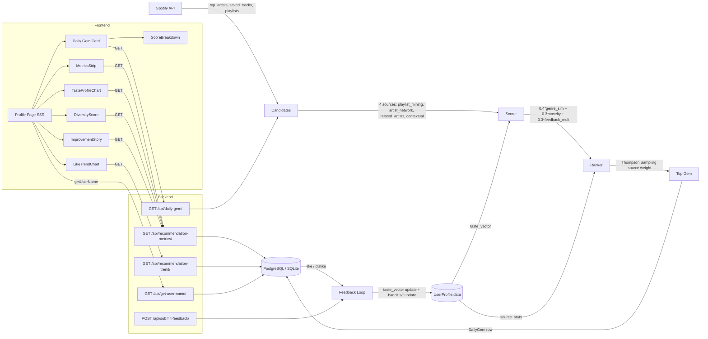

# SongScope — System Design

This document describes how data flows end-to-end through SongScope: from the Spotify API through candidate generation, scoring, the feedback loop, and back into the recommendation engine. For the mathematical background on each algorithm referenced here, see [CONCEPTS.md](CONCEPTS.md).

---

## Architecture Diagram



---

## Component Descriptions

### Profile Page (SSR)

The root of the user-facing application. Implemented as a Next.js async server component — it runs on the server at request time, fetches the authenticated user's display name via `getUserName()`, and renders all child components as React nodes. Chart and stat components that call the backend are client components (marked `"use client"`) that fetch independently after hydration.

Source: `frontend/app/profile/page.tsx`

Key invariants:
- Requires a valid `sessionid` cookie; redirects to `/` if missing.
- `getUserName()` calls `GET /api/get-user-name/` with the session cookie forwarded server-side — no client-side token exposure.
- Does not fetch metrics itself; each child component is responsible for its own data.

### MetricsStrip

Client component. Calls `GET /api/recommendation-metrics/` on mount and displays headline numbers: total gems recommended, gems liked, gems disliked, gem acceptance rate, average popularity, hidden gem rate, and the top genres list.

Source: `frontend/app/profile/components/MetricsStrip/MetricsStrip.tsx`

Key invariants:
- Calls the metrics endpoint exactly once on mount; no polling.
- Renders "Loading metrics..." during fetch and an error state on failure.
- Acceptance rate is displayed as a percentage (the backend returns a 0–1 float; the component multiplies by 100).

### LikeTrendChart

Client component. Calls `GET /api/recommendation-trend/` and renders a Recharts `LineChart` showing rolling 7-day like-rate over time. X-axis is date, Y-axis is 0–100%.

Source: `frontend/app/profile/components/LikeTrendChart/LikeTrendChart.tsx`

Key invariants:
- Renders an empty state message when fewer than 2 data points are returned (`message: 'Not enough data'`).
- Uses `ResponsiveContainer` from Recharts for fluid width.
- Stroke color matches the SongScope brand green (`#1DB954`).

### TasteProfileChart

Client component. Reads `top_genres_pct` from the `GET /api/recommendation-metrics/` response and renders a horizontal Recharts `BarChart` showing the top 10 genres as a percentage of total taste-vector weight.

Source: `frontend/app/profile/components/TasteProfileChart/TasteProfileChart.tsx`

Key invariants:
- Genre percentages sum to 100% over the top-10 slice (normalized server-side).
- Horizontal bars improve readability for long genre names (e.g., "atmospheric black metal").

### ImprovementStory

Client component. Reads `improvement_story` from the metrics endpoint and compares the like-rate of the user's first 7 gems to their most recent 7. Displays a delta (positive = model is learning, negative = model is drifting).

Source: `frontend/app/profile/components/ImprovementStory/ImprovementStory.tsx`

Key invariants:
- Renders "Not enough data" when `improvement_story.delta` is null (fewer than 2 gems).
- Delta is displayed as `+N pp` or `-N pp` (percentage points), not a raw ratio.

### DiversityScore

Client component. Reads `diversity_score` from the metrics endpoint and displays it as a single stat tile (0.0–1.0 range, rounded to 2 decimal places).

Source: `frontend/app/profile/components/DiversityScore/DiversityScore.tsx`

Key invariants:
- Renders "N/A" when `diversity_score` is null (fewer than 2 gems with genre data).
- Known limitation: `Track.genres` is only populated on explicit feedback; most historical gems have empty genre lists, so this score under-reports actual genre diversity (Pitfall 1 from research).

### ScoreBreakdown

Client component. Reads the `score_breakdown` field from the `GET /api/daily-gem/` response (passed as a prop from `DailyGemUI`) and renders three horizontal progress bars: Genre Match (`genre_sim`), Novelty (`novelty`), and Feedback (`feedback_multiplier`). Bar width is `Math.round(raw * 100 / 5) * 5` — rounded to the nearest 5% for visual cleanliness.

Source: `frontend/app/profile/components/DailyGem/ScoreBreakdown.tsx`

Key invariants:
- `score_breakdown` is returned in the `GET /api/daily-gem/` response for both cached and fresh gems. For cached gems it is read from the persisted `DailyGem.score_breakdown` column; for fresh gems it comes from `_score_recommendations()` and is simultaneously written to the DB.
- The component receives `score_breakdown` as a prop — it does not make an additional API call.
- Each raw float (0–1 range) is multiplied by 100 then rounded to the nearest 5 before rendering as a percentage width.

### Recommendation Engine (hybrid)

The core ML service. Generates candidate tracks from 4 active strategies, scores them using the compound formula, and applies Thompson Sampling source weights. Returns a ranked list; the top candidate becomes today's DailyGem.

Source: `backend/apps/recommendations/hybrid_recommendation_engine.py`

Four active candidate sources (verified strategy names called in `get_recommendations()`):
- `playlist_mining` — scans user's playlists for unheard tracks
- `artist_network` — explores artists similar to top artists
- `related_artists` — uses Spotify's related-artists graph
- `contextual` — time-of-day and recent listening context signals

Note: `genre_search` is defined in `SOURCE_DEFAULTS` (default weight 0.2) as a reserved slot for a planned future strategy but is not currently implemented or called.

Key invariants:
- Candidates are deduplicated before scoring.
- Tracks already in `RecommendationLog` or `DailyGem` for this user are filtered out before returning.
- Thompson Sampling source weights are computed once per request, not per candidate.

### Scoring & Ranking

Compound scoring formula applied inside `_score_recommendations()`:

```
score = 0.4 * genre_sim + 0.3 * novelty + 0.3 * feedback_multiplier
score *= source_weight  (Thompson Sampling, post-score multiplier)
```

Source: `backend/apps/recommendations/hybrid_recommendation_engine.py`, line 878

Key invariants:
- Weights (0.4, 0.3, 0.3) are locked — not tunable via API or user preference.
- `genre_sim` is cosine similarity between candidate artist genres and `UserProfile.data['taste_vector']`.
- `novelty` is a Gaussian bell-curve centered at `midpoint=30` (popularity), `width=20`.
- `feedback_multiplier` is 1.5 for liked artists, 0.5 for disliked artists, 1.0 otherwise.

### Feedback Loop (Personalization Engine)

Handles the online learning update on every like or dislike. Two simultaneous updates:

1. **Taste vector SGD** — increments or decrements genre weights in `UserProfile.data['taste_vector']` by `TASTE_VECTOR_LR = 0.1`. Clamped to 0 on decrement.
2. **Bandit update** — increments `source_stats[source]['s']` on like or `source_stats[source]['f']` on dislike, feeding the Thompson Sampling Beta posteriors.

Source: `backend/apps/recommendations/personalization_engine.py`, `apply_feedback_learning()` lines 254–317

Key invariants:
- No batch retraining — every feedback triggers an immediate DB write via `profile.save(update_fields=['data'])`.
- If the track has no genre data, both the taste-vector update and the bandit update are skipped — `apply_feedback_learning` returns early after logging a warning (`personalization_engine.py` line 275). Both updates require a non-empty genre list.
- Unlike reversal (`remove_feedback_learning`) is implemented for the case where a user unlikes a previously liked track.

### Persistence Layer

All user state is stored in Django ORM models:

| Model | Key fields | Purpose |
|-------|-----------|---------|
| `User` | Django built-in | Authentication identity |
| `UserProfile` | `data` (JSONField) | `taste_vector`, `source_stats`, `base_data`, `preferences` |
| `DailyGem` | `user`, `track`, `date`, `was_liked`, `track_popularity`, `score_breakdown` (JSONField, default={}), `score_total` (FloatField, nullable), `was_saved` (BooleanField, nullable), `taste_vector_snapshot` (JSONField, nullable), `was_skipped` (BooleanField, default=False — not yet wired) | One gem per user per day; source of truth for metrics. `score_breakdown` stores the three scoring components at gem creation time. `score_total` is the composite score. `was_saved` is set to True when the user saves the track to Spotify (independent of `was_liked`). `taste_vector_snapshot` captures the user's taste vector at recommendation time for offline evaluation — enables comparing what the model "knew" then against eventual feedback without reconstructing historical state. `was_skipped` exists in the model but is not yet wired to any view (reserved for a future skip-signal feedback loop). |
| `RecommendationLog` | `user`, `track`, `source`, `recommended_at`, `was_novel` | Audit trail for all candidates surfaced |
| `Track` | `spotify_id`, `name`, `artist`, `genres`, `popularity` | Cached track metadata; `genres` only populated on feedback |

Source: `backend/apps/core/models.py`

Key invariants:
- `UserProfile.data` is a single JSONField — all learning state in one column, no migration required for schema evolution.
- `DailyGem.was_liked` is set by `submit_feedback` (not at gem creation time); it starts as `None`.
- `Track.genres` sparsity is a known operational limitation (see Operational Constraints).

---

## API Surface

| Method | Path | View | Auth | Purpose | Phase added |
|--------|------|------|------|---------|-------------|
| GET | `/spotify-login/` | `spotify_login` | None | Initiate Spotify OAuth flow | 1 |
| GET | `/spotify/callback/` | `spotify_callback` | None | Handle OAuth callback, create session | 1 |
| GET | `/api/get-user-name/` | `get_user_name` | Session | Return Spotify display name for SSR | 1 |
| GET | `/api/daily-gem/` | `get_daily_gem` | Session | Return or generate today's DailyGem | 1 |
| POST | `/api/submit-feedback/` | `submit_feedback` | Session | Record like/dislike; trigger feedback learning | 1 |
| GET | `/api/check-auth/` | `check_auth` | Session | Verify session validity | 1 |
| GET | `/api/recommendations/` | `get_track_recommendations` | Session | Raw candidate list (debug/dev) | 1 |
| GET | `/api/personalization-summary/` | `get_personalization_summary` | Session | taste_vector + preference summary | 2/3 |
| GET | `/api/recommendation-metrics/` | `get_recommendation_metrics` | Session | On-the-fly metrics: acceptance rate, diversity, improvement story, top genres | 4 |
| GET | `/api/recommendation-trend/` | `get_recommendation_trend` | Session | Rolling 7-day like-rate time series | 4 |
| POST | `/api/add-track-to-liked/` | `add_track_to_liked` | Session | Save track to Spotify liked songs via `sp.current_user_saved_tracks_add()`. Side-effect: calls `DailyGem.objects.filter(user, date=today, track__spotify_id=track_id).update(was_saved=True)` so that `was_saved` can become `True` independently of `was_liked`. This enables OR-semantics in `compound_hit_rate`. | 4 |

All authenticated endpoints use Django session cookies (`sessionid`). There is no JWT or Bearer token layer.

---

## Data Flow: Daily Gem Request

Step-by-step sequence when a user opens `/profile`:

1. Next.js SSR executes `getUserName()` — `GET /api/get-user-name/` with session cookie forwarded in headers. Returns the Spotify display name for the welcome heading.
2. Page hydrates; `DailyGemUI` (client component) calls `GET /api/daily-gem/`.
3. Backend `get_daily_gem` checks `DailyGem.objects.filter(user=user, date=today)`. If a row exists, returns it immediately (idempotent).
4. If no row exists, `HybridRecommendationEngine` is instantiated for the user.
5. The engine calls `_update_profile_data()` to refresh `UserProfile.data['base_data']` from Spotify (top artists, saved tracks, playlists).
6. Four active candidate strategies (`playlist_mining`, `artist_network`, `related_artists`, `contextual`) each fetch a pool of tracks. Candidates are merged and deduplicated.
7. `_filter_out_liked_songs()` removes tracks already in `RecommendationLog` or `DailyGem` for this user.
8. `_score_recommendations()` applies `0.4 * genre_sim + 0.3 * novelty + 0.3 * feedback_multiplier` then multiplies by the Thompson-sampled source weight.
9. The top-ranked candidate's `score_breakdown` dict (`{genre_sim, novelty, feedback_multiplier, source}`) is passed to `_build_gem_explanation(breakdown, track_name, artist_name, source)`. This pure helper function inspects the three numeric components, identifies the dominant one (`argmax`), and returns a fixed sentence from one of four templates. No external call is made; the same breakdown always produces the same sentence. The result is stored as `DailyGem.explanation`.
10. Top-ranked candidate is saved as a `DailyGem` row (with `score_breakdown`, `score_total`, `explanation`, and `taste_vector_snapshot` populated) and a `RecommendationLog` row. The response to the frontend includes the `score_breakdown` dict so the `ScoreBreakdown` component can render the three bar values without a separate API call.
11. User sees the gem card and clicks thumbs-up or thumbs-down.
12. `DailyGemUI` posts `POST /api/submit-feedback/` with `{track_id, feedback_type}`.
13. `submit_feedback` calls `personalization_engine.apply_feedback_learning(feedback)`, which updates `UserProfile.data['taste_vector']` and `UserProfile.data['source_stats']` in a single DB write.
14. `MetricsStrip`, `LikeTrendChart`, `TasteProfileChart`, `DiversityScore`, and `ImprovementStory` silently re-fetch their data on the user's next page load.

---

## Operational Constraints

- **Single-user assumption:** All models are per-user. There is no shared representation across users, no collaborative filtering, and no population-level signal. Metrics are computed per-user only.
- **No caching layer:** Metrics endpoints compute on-the-fly from DB rows on every request. At low gem counts (<100 per user) this is sub-millisecond; at scale a Redis cache would be appropriate.
- **On-the-fly metric computation:** Jaccard diversity is O(N^2) in the number of gems. At 365 gems/year the full pairwise computation is ~66,000 pairs — acceptable, but worth caching at higher volumes.
- **`Track.genres` sparsity:** Genres are populated only when a user explicitly submits feedback (like/dislike). DailyGems without feedback have no genre data. This means diversity and taste-vector accuracy both degrade gracefully with lower feedback volume. Mitigation: backfill genres at DailyGem creation time using the Spotify artist endpoint (deferred).
- **Spotify API rate limits:** All Spotify calls go through `spotipy` with a `rate_limit_monitor`. Profile refresh is skipped if cached data is less than 5 minutes old (`_cache_ttl = 300`). Excess API calls raise `SpotifyException` and fall back to cached recommendations.
- **Deferred security hardening:** `SECRET_KEY` is committed to version control, CSRF is disabled on feedback endpoints, and the Spotify client secret is referenced from settings (not env-only). These are documented risks deferred to a post-MVP security phase.

---

## Cross-References

- [CONCEPTS.md](CONCEPTS.md) — Algorithm deep-dives: cosine similarity, Thompson Sampling, SGD taste vector, Jaccard diversity, novelty scoring, compound metric, Spotify API pivot.
- [INTERVIEW_PREP_SONGSCOPE.md](INTERVIEW_PREP_SONGSCOPE.md) — Q&A format interview prep: design decisions, trade-offs, project narrative.
- [.planning/ROADMAP.md](.planning/ROADMAP.md) — Phase build history, verification criteria, decision log.
